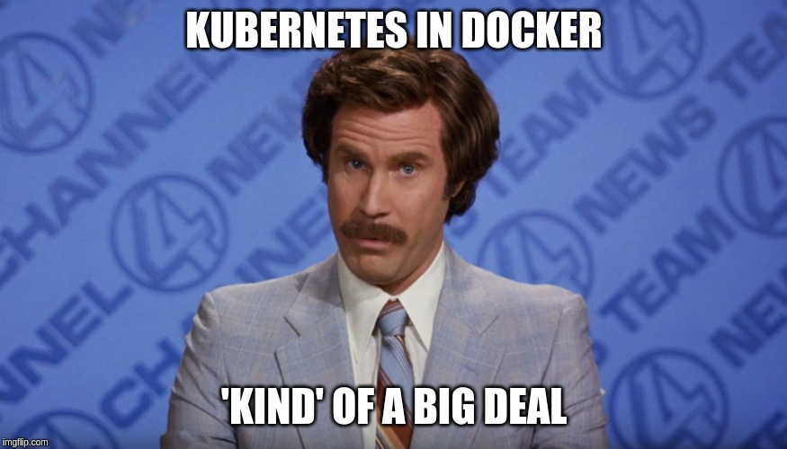

##### An introduction to [kind](sigs.k8s.io/kind)

Duffie Cooley @mauilion

Staff Cloud Native Architect at VMware

Catch me on [twitter](https://twitter.com/mauilion), [slack.k8s.io](https://kubernetes.slack.com/team/U37TLLWAU), or [mauilion.dev](https://mauilion.dev)
[materials at github.com/mauilion/kind-demo](https://github.com/mauilion/kind-demo)

---

## sigs.k8s.io/kind

[materials at github.com/mauilion/kind-demo](https://github.com/mauilion/kind-demo)

---

---

#### Kubernetes in Docker

---

#### Why kind?
 

* supports multi-node (including HA) clusters
* customizable base and node images
* can use your local kubernetes branch
* written in go, can be used as a library
* can be used on Windows, MacOS and Linux
* CNCF certified conformant Kubernetes installer

---

#### a bit about `kubeadm`
 

* tooling that will get you from infrastructure to Kubernetes
* it will not set up the infrastructure for you.
* it is infinitely configurable
* `kind` leverages `kubeadm` to initalize clusters!

---

#### What are folks using kind for?
 

* [kind in a ci pipeline](https://www.loodse.com/blog/2019-03-12-running-kubernetes-in-the-ci-pipeline-/)
* [local development]()
* [demos of newer Kubernetes features](https://github.com/phenixblue/k8s-opa-demo)
* [kinder tooling to test kubeadm](https://github.com/kubernetes/kubeadm/tree/master/kinder)
* "/test pull-kubernetes-e2e-kind" on Kubernetes PRs for faster e2e feedback. Should be roughly 15-20 minutes currently 🎉

---

### Thanks to @BenTheElder
#### and all the other contributors for such a fantastic project!

---

### And now without further ado

## Demo Time!!

See github.com/mauilion/kind-demo for the config!

